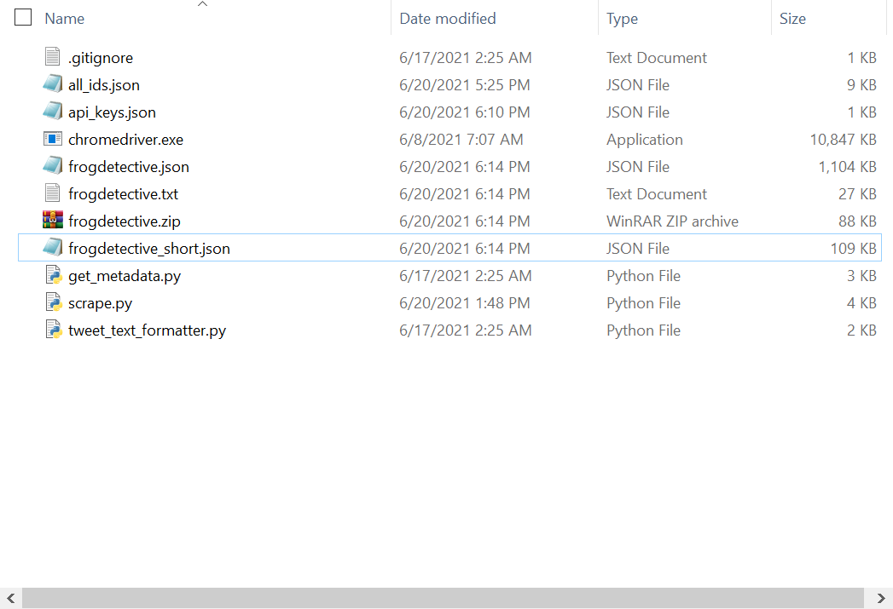
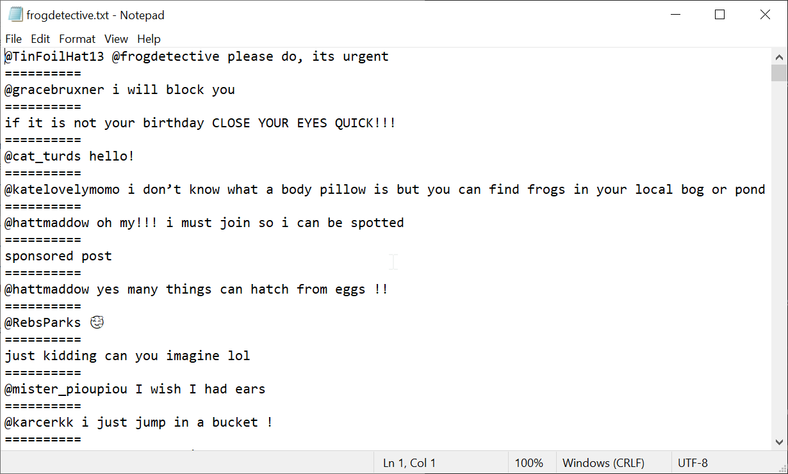
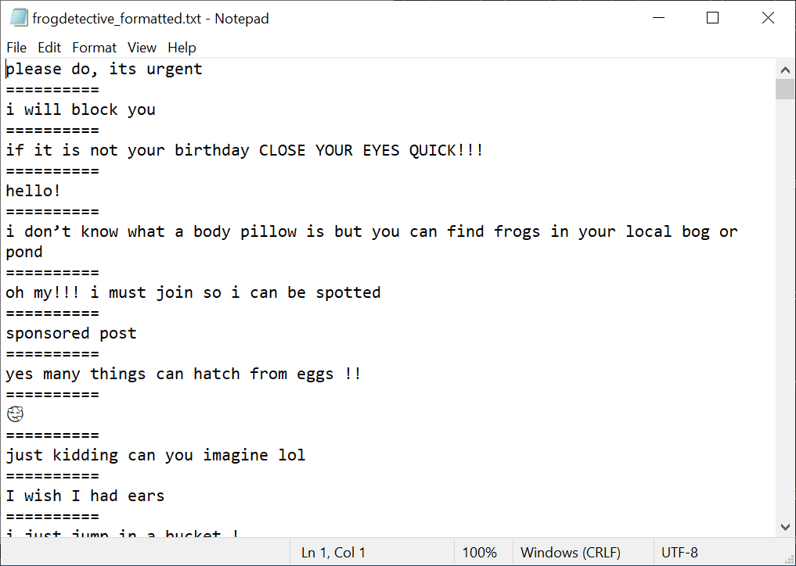
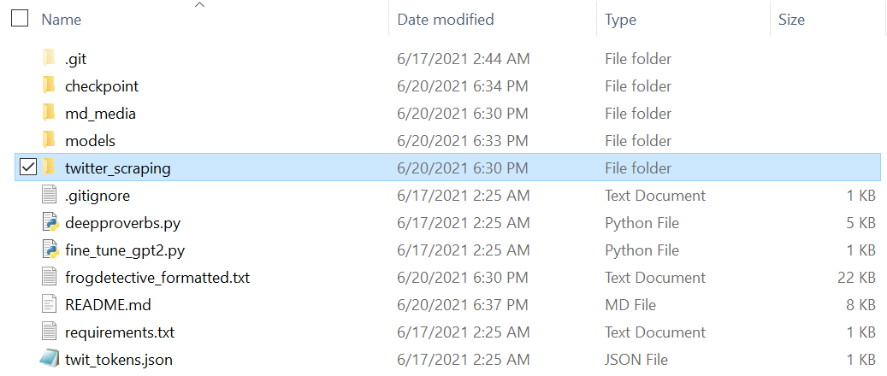

## Easy Twitter Deep Fake Bot

This is a tutorial to create a deep fake bot on your own w/ little to no coding experience! I heavily utilized existing repositories and am simply bridging the gap with a little code. For my example, I used @frogdetective from the 'Frog Detective' video game series by 'Worm Club'. Please check out their work!!

Furthermore, if you have any suggestions, please let me know! I did this project over a two-day period so there will be some messy structure/code.

To credit the work I used immediately, I used nbertagnolli's ["Deep Proverbs"](https://github.com/nbertagnolli/DeepProverbs) repo and bpb27's ["twitter_scraping"](https://github.com/bpb27/twitter_scraping) repo. Please check out their original work and I will mention where and how their work is used.

The 4 steps to this process include:
1) Scraping a Twitter account of designated tweets(["twitter_scraping"](https://github.com/bpb27/twitter_scraping))
2) Formatting the output
3) Training a GPT-2 model with the formatted output
4) Generating text and tweeting (["Deep Proverbs"](https://github.com/nbertagnolli/DeepProverbs))

Let's get started!

## Requirements

I will list all of the dependencies here as well as in a requirements.txt file.

- An important note that served as a headache for me is that python3.7 or **BEFORE** must be used. For a quick explanation, the gpt-2-simple package requires tensorflow version 1.14/1.15. Both of these versions are not supported by python3.8 and beyond.

- If you wish to avoid issues with dependencies, I highly recommend you create a conda virtual env with all of these packages. Here is the [tutorial](https://stackoverflow.com/questions/61491893/i-cannot-install-tensorflow-version-1-15-through-pip) I used to install n virtual environment **with the specific version of Python**. Here is another [great resource](https://towardsdatascience.com/manage-your-python-virtual-environment-with-conda-a0d2934d5195) for learning more about conda virtual environments. 

Dependency List
- Python 3.7
- tensorflow==1.15.0
- gpt-2-simple
- tweepy
- click
- numpy
- jupyter
- selenium

**To install all of these easily in the command line(or in the conda env if you decided to go down that route), you can simply use the command `pip install -r requirements.txt`.** The command will read off of the `requirements.txt` file I have provided.

**Etc. Dependency(REQURED)**
- Using selenium(for the scraping portion) requires a browser driver of some kind. I used the [chromedriver](https://chromedriver.chromium.org/downloads). Please download the proper version which corresponds to your personal browser and place the .exe(in my case 'chromedriver.exe') in the `/twitter_scraping` folder.

## 1) Scraping a Twitter Account(from bpb27's repo)
- "open up `scrape.py` and edit the user, start, and end variables (and save the file)
- run `python scrape.py`
- you'll see a browser pop up and output in the terminal
- do some fun other task until it finishes
- once it's done, it outputs all the tweet ids it found into `all_ids.json`
- every time you run the scraper with different dates, it will add the new ids to the same file
  - it automatically removes duplicates so don't worry about small date overlaps"

Sometimes I would get a rate-limiting error from twitter. In that case, increase the `delay` variable in `scrape.py` so that the program scrapes more slowly not to trigger the error.

The previous steps simply get the tweet **ids**. Given these IDs, we can retrieve the metadata which consists of the important information such as the text content of a particular tweet. **Here are the rest of the instructions from bpb to retrieve the metadata given the IDs.**

- "first you'll need to get twitter API keys
  - sign up for a developer account here https://dev.twitter.com/
  - get your keys here: https://apps.twitter.com/
- put your keys into the `api_keys.json` file
- the api key = consumer key, api secret key = consumer secret key, and the access and access secret tokens are named properly
- open up `get_metadata.py` and edit the user variable (and save the file)
- run `python get_metadata.py`
- this will get metadata for every tweet id in `all_ids.json`
- it will create 5 files
  - `username.json` (master file with all metadata)
  - `username.zip` (a zipped file of the master file with all metadata)
  - `username_short.json` (smaller master file with relevant metadata fields)
  - `username.csv` (csv version of the smaller master file)"
  - `username.txt` (text version of ONLY the tweets/replies)

- This is what the directory should look like.

To wrap this section up, you will **only** need the `username.txt` file. This is what will be used as a basis for the formatted training data. This file should look like:

## 2) Formatting the output
- We will be using the `tweet_text_formatter.py` to remove all links as well as reply tags(@username at the start of a tweet).
- Open up `tweet_text_formatter.py` and edit the `tweet_output` and `formatted_output` variables. `tweet_ouput` should equal `username.txt` and `formatted_output` variable can be equal to any arbitrary value but for the example, we will be using `user_formatted.txt` for the value
- Run `python tweet_text_formatter.py`
- A file named `user_formatted.txt` should be generated

- Move the file to the main directory so it is at the same level as `deepproverbs.py`

## 3) Training the Model
- I used the given example script to train my model. AFAIK, `deepproverbs.py` can also be used train a model.
- Open up `fine_tune_gpt2.py`, and edit `text_path` to equal to `username_formatted.txt`, or the formatted text file that was created in part 2.
- Run `python fine_tune_gpt2.py`. This will take a while.
- When it is complete, there should be two new directories, `checkpoint` and `models`.

## 4) Generating + Tweeting
- Thanks to nbertagnolli's script here, both text generation from the trained model and tweeting the text is incredibly easy
- `deepproverbs.py` contains 3 command line methods: finetune, generate, and post-tweet
- If you wish to simply view some samples of generated text, run `python deepproverbs.py generate`
- If you wish to tweet, first ensure that `twit_tokens.json` contains your Twitter app credentials(same way the credentials were retrieved from step 1). Unfortunately, the variable names are different although the values should be the same so please copy and paste them in individually.
  - Furthermore, you must go into the Twitter developer portal for your app and change the "App Permissions" settings so that the app is "Read + Write" or else you will get an error like so `tweepy.error.TweepError: Read-only application cannot POST.` **If you did have to change this information, you MUST regenerate the access  tokens for the app.** 
- Finally, run `python deepproverbs.py post-tweet checkpoint twit_tokens.json`

And done!! You should see a new tweet that was generated with your model on your profile!

## Conclusion
Given that I barely know how the GPT-2 model works under the hood, I thought it was even more impressive that I could do something with it given basic tutorials. In order to train a more complex and well developed model, that knowledge is definitely required, but that's not quite what I was doing here. It was simply an application of an idea I had over the weekend and thought I'd share it in hopes a newer developer could find some merit running through the tutorial with a, in my opinion, fun pay off.

Thanks again to Github users nbertagnolli and bpb27 for publicly releasing those amazing repos that helped me put this together in a matter of hours!